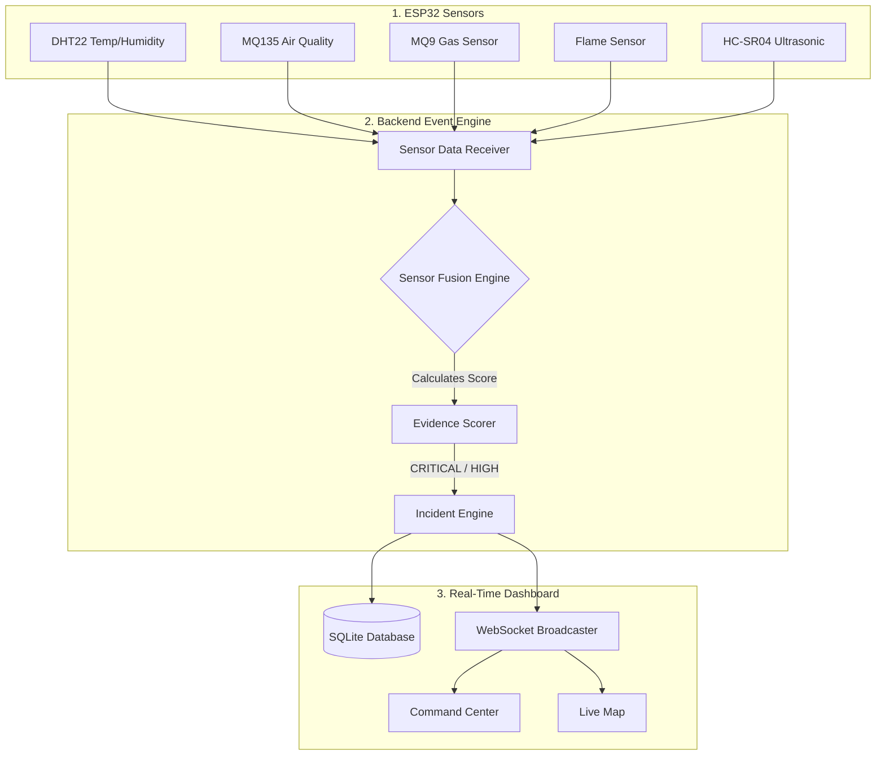
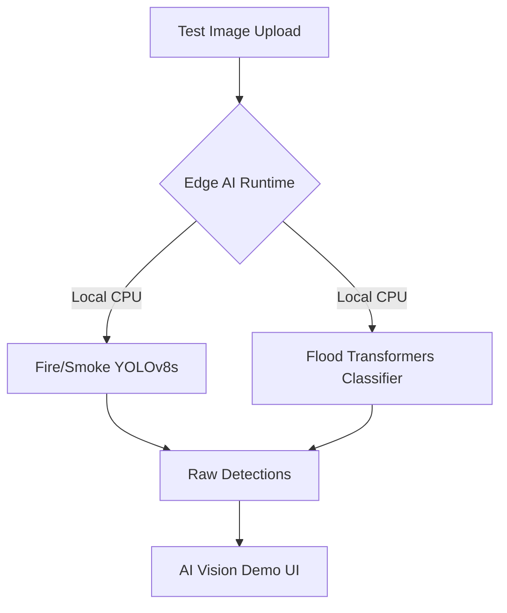
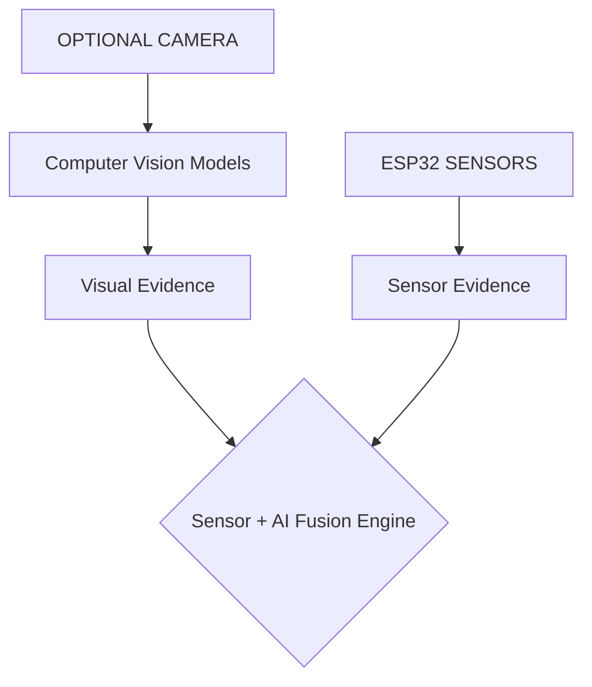

# DisasterView System Architecture

## Overview
This document clarifies the exact architecture of the DisasterView system. 
The system is built on a **physical sensor-first** paradigm. AI computer vision is currently a supplementary software demonstration module.

---

## 1. CURRENT: Physical Sensor-First Architecture

The active deployment relies purely on ESP32 environmental sensors.

### Sensor Fusion Logic
- **FIRE**: Triggered by Flame Sensor + Temperature (DHT22) + MQ9/MQ135 Gas.
- **SMOKE**: Triggered by MQ135 + MQ9 + Temperature contexts.
- **FLOOD**: Triggered by HC-SR04 calculating physical distance to water surface.

---

## 2. SEPARATE AI DEMO: Software Demonstration

The integrated computer vision models (Fire/Smoke and Flood) are **decoupled** from the active incident pipeline. They serve as a proof-of-concept software demonstration to validate the models before any future camera hardware is introduced.

*Note: This pipeline does NOT generate live system incidents or spoof a physical camera.*

---

## 3. FUTURE: Hardware Camera Integration

The architecture supports integrating an optional camera module in the future. The system will continue to work perfectly without it, but when connected, the AI will provide supplemental visual evidence to the Sensor Fusion engine.

## Architectural Principles
1. **Honesty:** There is no live camera stream. The AI page is an explicit software testing utility.
2. **Resilience:** The Sensor Fusion Engine generates incidents based on physical telemetry. AI Detections are optional.
3. **Demo Mode:** The Demo Mode (in Settings) simulates actual ESP32 payload triggers directly into the fusion engine to test the robust multi-modal backend, rather than instantly spawning fake database rows.
